# Architecture & Data Flow

How a proposal PDF gets made, end to end. Every explanation lives **inside the diagrams** — read
the diagrams, not the gaps between them.

Diagrams are Mermaid and render directly on GitHub.

---

## 1. The whole system at a glance

Where each piece runs, and what crosses the network.

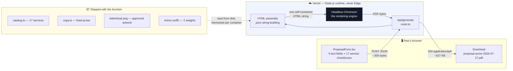

> **No database. No AI. No network calls during rendering.** The same input always produces the
> same bytes — see §6.

---

## 2. End-to-end data flow

The full journey of one click, including where Chromium enters and why.

```mermaid
sequenceDiagram
    autonumber
    actor Rep
    participant Form as ProposalForm.tsx
    participant API as route.ts
    participant VM as view-model.ts
    participant TPL as template.ts
    participant PDF as pdf.ts
    participant CR as 🌐 Chromium

    Rep->>Form: fills fields, ticks services, clicks Generate
    Note over Form: zod check with the SAME schema<br/>the server uses — UX only,<br/>never a trust boundary
    Form->>API: POST /api/generate  {recipient, company, date, serviceIds[]}

    API->>API: parse JSON → zod → unknown ids → duplicate ids
    Note over API: any failure ⇒ 400 with per-field<br/>messages, nothing rendered

    API->>VM: toViewModel(input)
    Note over VM: filters the CATALOG (not the input)<br/>so services always appear in<br/>canonical order, never click order
    VM-->>API: ProposalViewModel

    API->>TPL: buildProposalHtml(vm)
    Note over TPL: escapes every rep-supplied value<br/>at interpolation — the single<br/>injection boundary
    TPL-->>API: complete HTML string<br/>(fonts + artwork inlined as base64)

    API->>PDF: renderPdf(html, proposalDate)

    rect rgb(17, 24, 39)
        Note over PDF,CR: ⬇️ THIS IS WHAT CHROMIUM IS FOR ⬇️
        PDF->>CR: launch browser
        PDF->>CR: setContent(html)
        CR->>CR: parse HTML, apply CSS, decode base64 fonts + PNG
        CR->>CR: lay out text, measure lines, break into A4 pages
        PDF->>CR: await document.fonts.ready
        PDF->>CR: page.pdf({format A4, printBackground})
        CR-->>PDF: PDF bytes
        PDF->>CR: close browser
    end

    Note over PDF: rewrite /CreationDate + /ModDate<br/>to the proposal date, same byte length
    PDF-->>API: Buffer

    API-->>Form: 200 · application/pdf · Content-Disposition: attachment
    Form->>Rep: Blob → object URL → invisible download link → click
```

---

## 3. What Chromium actually does here

The one question this tool always raises. Chromium is **not** a browser in this system — it is the
typesetting engine.

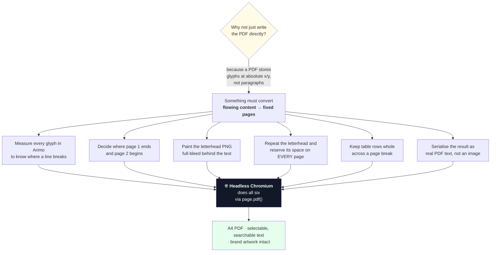

**Which Chromium runs depends on where the code is:**

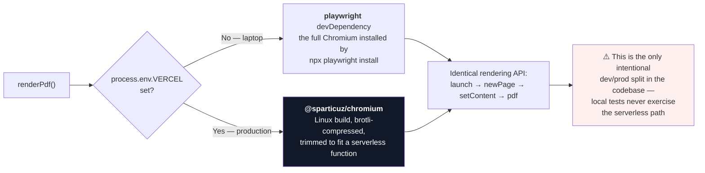

**Chromium's lifecycle per request — and the leak it causes:**

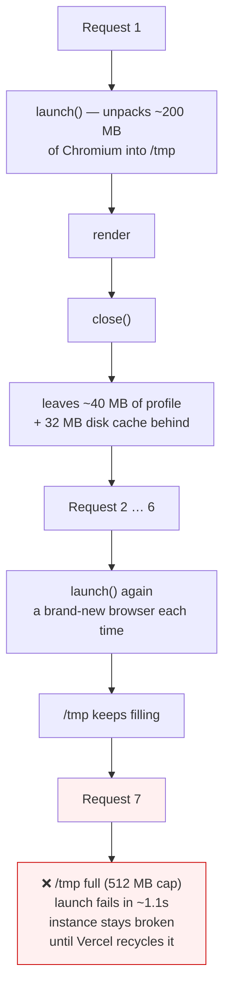

> ⚠️ **Known defect, reproduced 2026-07-27.** The per-request `launch()`/`close()` above is the
> cause of both the sequential failure at ~request 7 and the concurrent-request failures.
> Full diagnosis: `history/prompts/general/0006-diagnose-sequential-render-exhaustion.prompt.md`.
> The fix is to cache one browser per instance and close the *page* instead.

---

## 4. How the HTML is assembled

Nine small modules, each with one job, composing a single string. All pure functions except the
two that read from disk.

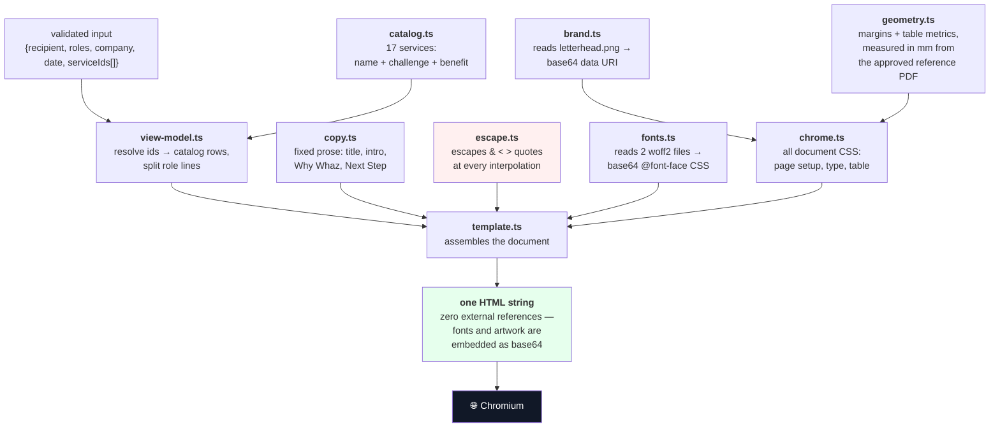

> `fonts.ts` and `brand.ts` are the only modules that touch the filesystem. Both memoise in module
> scope, so the base64 encode is paid once per warm container rather than per request.

---

## 5. Why the letterhead needs two separate mechanisms

The single least obvious part of the design. Remove either half and multi-page output breaks
silently — the text slides underneath the header band on page 2.

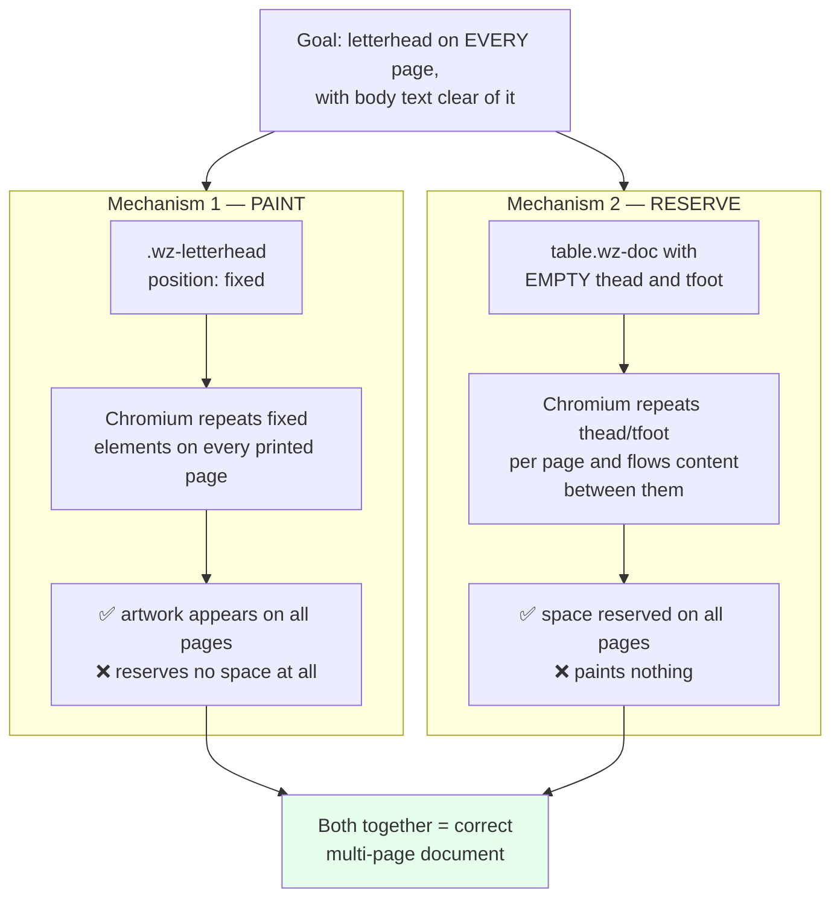

Two simpler approaches were built and both failed:

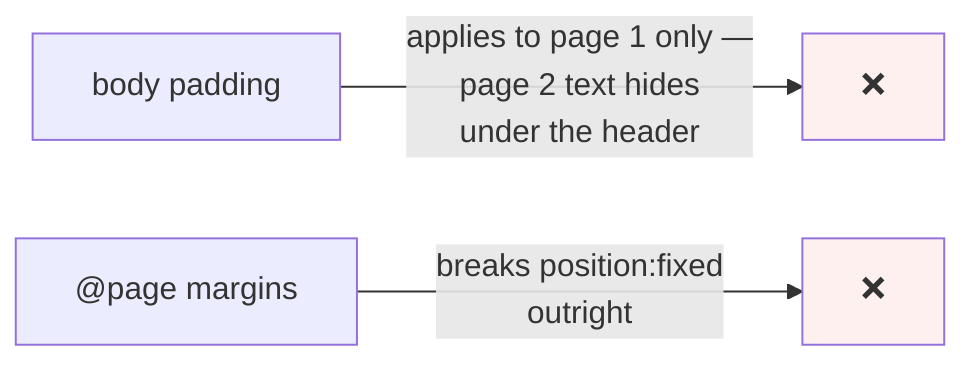

---

## 6. Determinism — why the same input gives identical bytes

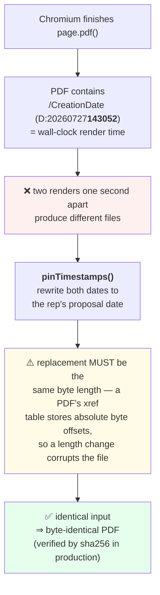

---

## 7. Error paths

Nothing partial is ever sent. The document either renders completely or the rep gets a message.

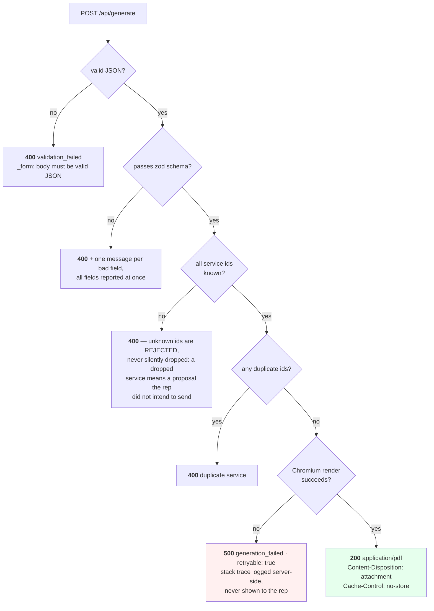

---

## 8. Two fields that are collected but never printed

A recurring source of confusion when reading the form.

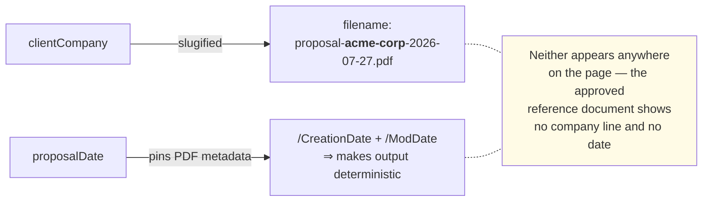

---

## Module reference

| File | Job | Pure? |
|---|---|---|
| `components/ProposalForm.tsx` | Form state, client-side validation, triggers download | — |
| `app/api/generate/route.ts` | Validation gate + orchestration | — |
| `lib/schema.ts` | zod schema shared by client and server | ✅ |
| `lib/view-model.ts` | Input → resolved catalog rows in canonical order | ✅ |
| `lib/catalog.ts` | The 17 services and their table copy | ✅ |
| `lib/copy.ts` | Fixed document prose | ✅ |
| `lib/escape.ts` | The single injection boundary | ✅ |
| `lib/template.ts` | Assembles the HTML string | ✅ |
| `lib/chrome.ts` | All document CSS | ✅ |
| `lib/geometry.ts` | Margins and table metrics in mm | ✅ |
| `lib/brand.ts` | letterhead.png → base64 | reads disk |
| `lib/fonts.ts` | woff2 → base64 @font-face | reads disk |
| `lib/pdf.ts` | Chromium launch, render, timestamp pinning | — |
| `lib/filename.ts` | Download filename slug | ✅ |

Setup, scripts and troubleshooting: `docs/DEVELOPMENT.md`.
Why the letterhead is a raster rather than CSS: `history/adr/` (ADR-0001).
